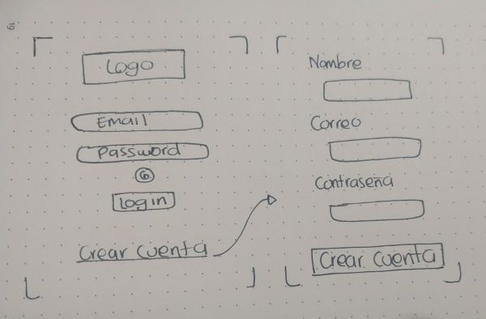
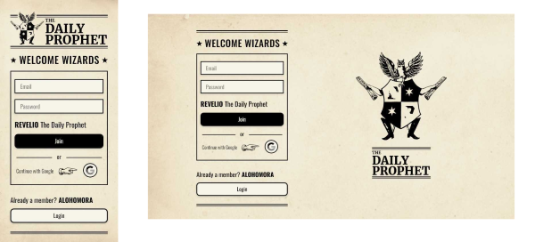
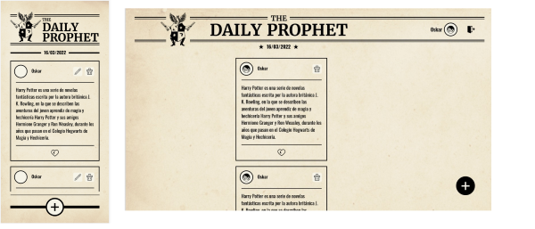

# The Daily Prophet - Social Network

## Índice

* [1. Definicion del producto](#1-Definicion-del-producto)
* [2. Resumen-del-proyecto](#2-Investigación-UX)
* [3. Consideraciones-generales](#3-Consideraciones-generales)
* [4. Criterios de aceptacion](#4-Criterios-de-aceptación)
* [5. Herramientas](#5-Herramientas)

## 1. Definicion del producto

The Daily Prophet es una red social dirigida a aficionados de Harry Potter 
que tiene como finalidad compartir información relacionados con el tema.

## 2. Resumen del proyecto

The Daily Prophet es una Red Social que permite a cualquier usuario crear una cuenta de
acceso y loguearse con ella, o ingresar con su cuenta de Google; En el muro se puede
crear, editar, borrar y "likear_ publicaciones.

El objetivo principal de este proyecto es construir 
una Single Page Application (SPA), responsive con más de una vista / página,
en la que se puede leer y escribir datos.

## 3. Consideraciones generales

Este proyecto se resolvió en un equipo de tres:

Desarrolladoras:
Anamaria Medina
Angélica Losada
Yara El Zein 

## 4. Criterios de aceptación 

### 4.1 Historias de usuario

Una vez entendidas las necesidades de nuestros usuarios, se describen las Historias
de Usuario en nuestro tablero de [Trello](https://trello.com/b/KKzZPLkb/social-network),
representando todo lo que el usuario quiere hacer y ver, 
como resultado de una breve investigación. 

Cada una de las Historias de Usuario especifican la Definición de terminado (_definition of done_)
y los Criterios de Aceptación.

### 4.2 Diseño de la Interfaz de Usuario (prototipo de baja y alta fidelidad)

### 4.3 Consideraciones del comportamiento de la interfaz de usuario (UI)

#### Creación de cuenta de usuario e inicio de sesión

* Login con Firebase:
  - Creación de cuenta de acceso y autenticación con cuenta de correo y
    contraseña, y también con una cuenta de Google.
* Validaciones:
  - Solamente se permite el acceso a usuarios con cuentas válidas.
  - No pueden haber usuarios repetidos.
  - La cuenta de usuario debe ser un correo electrónico válido.
  - Lo que se escriba en el campo (_input_) de contraseña es secreto.
* Comportamiento:
  - Al enviarse el formulario de registro o inicio de sesión, se valida.
  - Si hay errores, se muestran mensajes descriptivos para ayudar al
    usuario a corregirlos.

#### Muro/timeline/Daily

* Validaciones:
  - Al publicar, se valida que exista contenido en el _input_.
* Comportamiento:
  - Al recargar la aplicación, se verificar si el usuario está _logueado_
    antes de mostrar contenido.
  - Se puede publicar un _post_.
  - Se puede dar y quitar _like_ a una publicación. Máximo uno por usuario.
  - Se Lleva un conteo de los _likes_.
  - Se puede eliminar un post específico por usuario.
  - Se puede editar una publicacion segun el usuario.
  - Los textos editados se muestran en tiempo real.

### 4.4 Consideraciones técnicas Front-end

* La lógica del proyecto está implementada completamente en JavaScript
  (ES6+), HTML y CSS: no se utiliza frameworks o librerías de CSS y JS.
* Es una Single Page Application (SPA)
* Los datos agregados y modificados persisten a lo largo de la aplicación,
  para esto utilizamos Firebase y Firestore.

## 5. Herramientas

* [Git](https://git-scm.com/)
* [GitHub](https://github.com/)
* [GitHub Pages](https://pages.github.com/)
* [Trello](https://trello.com/b/okSEXWkl/dl15anamargaritaangelica)
* [Node.js](https://nodejs.org/)
* [Jest](https://jestjs.io/)
* [Adobe XD](https://www.adobe.com/la/products/xd.html)
* [Visual Studio Code](https://code.visualstudio.com/)