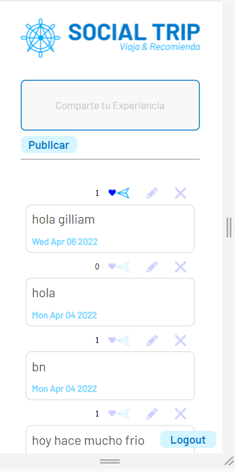

SOCIAL TRIP

Social Trip es una red social para amantes de los viajes, en esta red social los viajeros prodran registrarse con un correo electronico valido y crear una contraseña, iniciar sesión con correo y contraseña o co una cuenta de google. Los usuarios podrán compartir sus experiencias y opiniones publicando post en su muro, editarlos, eliminarlos y darle like a los post propios y de los demás usuarios.

Para el desarrollo de esta aplicación tuvimos como eje principal el usuario, es por esto que hicimos entrevistas para conocer de cerca a usuarios potenciales y saber que esperaban y que les gustaria encontrar en esta app, realizamos prototipos de baja y alta fidelidad, los cuales fuimos iterando hasta losgrar el producto final, pensando en la accesibilidad de los usuarios.

Realizamos entrevistas:

Filtramos la información:

Con la información filtrada creamos nuestras historias de usuario:

Creamos prototipos de baja fidelidad:

Prototipo de alta fidelidad con interacción:
https://www.figma.com/proto/6lkweuUHyUHjKzzw1rFBqV/RED-SOCIAL---VIAJEROS?node-id=28%3A140&scaling=scale-down&page-id=0%3A1&starting-point-node-id=28%3A140

Vista final de nuestra aplicación:

